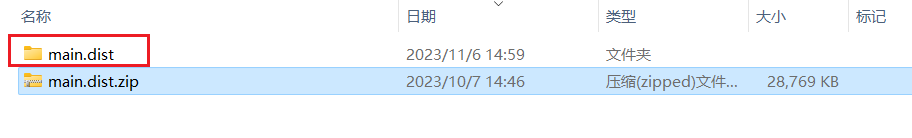
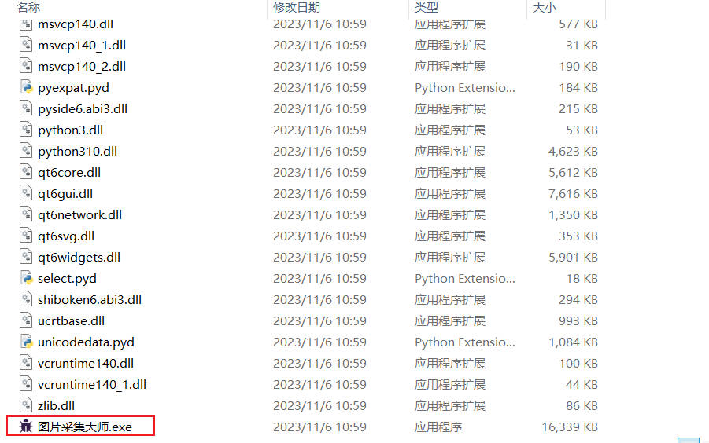
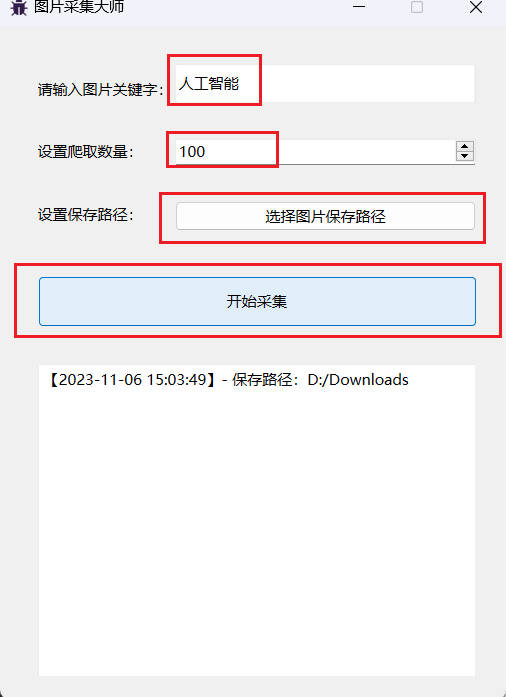
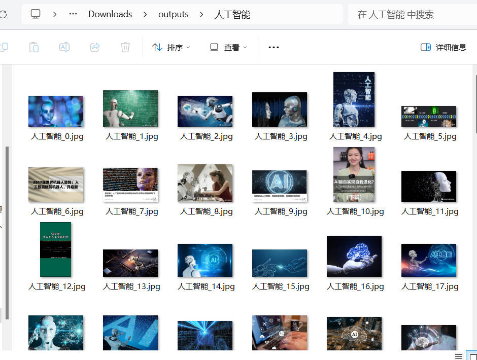

# 🌟 ImageCollectMaster图片采集大师🌟 

- [🌟 ImageCollectMaster图片采集大师🌟](#-imagecollectmaster图片采集大师)
  - [一、简介](#一简介)
  - [二、如何使用呢？](#二如何使用呢)
    - [方式1：exe运行（仅windows版本）——**无脑使用**](#方式1exe运行仅windows版本无脑使用)
    - [方式2：python运行（只要配置环境即可运行）](#方式2python运行只要配置环境即可运行)
  - [三、使用教程（exe）](#三使用教程exe)
## 一、前言
  ImageCollectMaster图片采集大师——基于 [master分支](https://github.com/CrabBoss-lab/ImageCollectMaster/tree/master) 开发了GUI界面

## 二、简介

该软件是一款强大的**批量采集图片工具**，
旨在帮助用户通过设置关键字和数量， 快速、高效地从互联网（baidu图库）上采集大量的图片。
它提供了简洁直观的用户界面，使用户能够轻松地设置采集参数并开始批量采集操作。
无论是个人用户还是专业用户， 都可以通过这款软件方便地获取所需的图片资源。

## 二、如何使用呢？

### 方式1：exe运行（仅windows版本）——**无脑使用**
- 优点：无需依赖任何环境，下载即可使用
- 下载地址：
  - [点我：下载【main.dist.zip】压缩包](https://github.com/CrabBoss-lab/ImageCollectMaster/releases)
  - 注：下载最新版本（标有Latest）
- [使用教程]( ##三、使用教程（exe） )

### 方式2：python运行（只要配置环境即可运行）
```
pip install -r requirements.txt 
python main.py
```

## 三、使用教程（exe）
1、解压下载好的【main.dist.zip】压缩包


2、进入文件夹内，找到【图片采集大师.exe】,并双击运行


3、在界面中设置采集参数（图片关键字、爬取数量、保存路径）后，并单击开始采集即可


4、运行完成后,会将图片保存至预设的路径下：


注：开启代理或梯子，会导致无法爬取图片！请在关闭后再次运行！

## 如有其他问题，欢迎提交PR！！